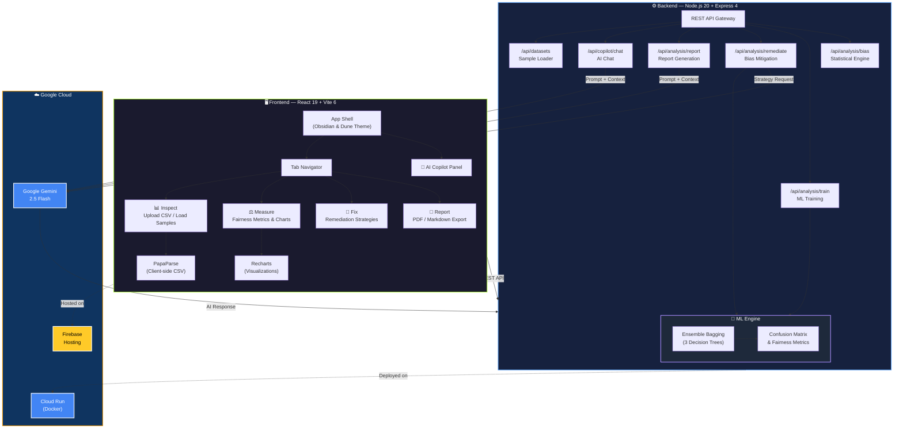

<div align="center">

# ⚖️ FairLens

### Clinical-Grade AI Fairness Auditor & Compliance Dossier Generator

**Detect · Measure · Remediate · Report — Algorithmic Bias**

[](LICENSE)
[](https://nodejs.org)
[](https://react.dev)
[](https://vitejs.dev)
[](https://ai.google.dev)
[](#)

<br />

**FairLens** is a next-generation, AI-native web platform that empowers data scientists, machine learning engineers, and compliance officers to **audit, explain, and mitigate** algorithmic bias in ML datasets and predictive models — before they reach production.

[Getting Started](#-getting-started) · [Features](#-features) · [Architecture](#-architecture) · [Interactive Demo](#-narrated-interactive-demo) · [API Reference](#-api-reference) · [Deployment](#-deployment)

</div>

---

## 🧬 Why FairLens?

AI models make life-altering decisions daily — screening resumes, scoring credits, prioritizing medical care, and directing law enforcement. However, these models learn from historical datasets containing **implicit human and systemic biases**, often compounding and cementing inequalities.

| Key Problem | How FairLens Solves It |
|---|---|
| **Invisible Disparities** | Visual profiling with auto-detected sensitive demographic attributes. |
| **Compounded Disadvantage** | **Intersectional Bias Matrix** maps the combined impact of multiple attributes (e.g., race *and* gender). |
| **Black-Box Decisioning** | **Profile Flipper** simulates counterfactual changes at the individual level to inspect model consistency. |
| **Complex Remediation** | One-click mitigation simulations (Re-weighting, Proxy Removal, Calibrated Resampling) with trade-off charts. |
| **Compliance Audits** | Automated compliance checkers validating against standards like the **EEOC 4/5ths Rule** and the **India DPDP Act 2023**. |
| **Regional Accessibility** | Full **Bilingual Interface** supporting English and Hindi locales for localized auditing. |

---

## ✨ Features

### 📊 1. Inspect & Parse
*   **Privacy-First Parsing**: Upload CSV datasets locally. Processing is executed client-side via **PapaParse** — your raw data never leaves the browser.
*   **Column X-Ray**: Auto-categorizes columns into target variables, features, and sensitive attributes.
*   **Curated Scenarios**: Load sandbox datasets reflecting real-world bias challenges:
    *   *HR Hiring Bias* (15k rows) — Gender and educational disparities.
    *   *Loan Approval Bias* (10k rows) — Caste and income-based disparities in lending.
    *   *Medical Diagnosis Bias* (12k rows) — Age-group and sex biases in cardiovascular disease detection.

### ⚖️ 2. Measure & Predict
*   **Forensic Bias Engine**: Real-time computation of statistical metrics including **Disparate Impact Ratio**, **Statistical Parity Gap**, and **Equalized Odds**.
*   **Intersectional Bias Matrix**: Visualizes compounded disadvantage across overlapping protected attributes. Powered by **Google Gemini** to generate contextual insights explaining structural bias.
*   **Ensemble ML Model**: Train a server-side bagged decision-tree classifier to observe model prediction metrics (TPR, FPR, Accuracy, F1) across demographic groups.

### 🔧 3. Fix (Mitigation)
*   **Remediation Simulator**: Apply mitigation strategies and view side-by-side performance comparison:
    *   *Re-weighting*: Adjusts mathematical weights of samples to equalize group rates.
    *   *Proxy Removal*: Suppresses features highly correlated with sensitive attributes.
    *   *Calibrated Resampling*: Balances representation in subset partitions.
*   **AI Remediation Advisor**: Google Gemini analyzes your specific statistical context and ranks optimization strategies.

### 📄 4. Report & Document
*   **AI Nutrition Label**: Renders an executive compliance overview with overall fairness scores, risk ratings, and validation flags.
*   **Automated Audit Dossiers**: Generates an exhaustive audit trail describing baseline bias, trained model performance, applied remediations, and compliance statuses.
*   **Multi-Format Export**: One-click download of official reports as **PDF** (via jsPDF/html2canvas) or **Markdown**.

---

## 📽️ Narrated Interactive Demo

FairLens features a built-in, 90-second automated narrated tour. Clicking **"Watch 90-sec Demo"** triggers a scripted walk-through that:
1.  Loads the **Hiring Bias 15k** CSV dataset.
2.  Configures target labels and sensitive attributes.
3.  Executes the bias engine and trains the ML classifier.
4.  Identifies intersectional issues and invokes Gemini explanations.
5.  Simulates **Re-weighting** remediation and highlights the before-vs-after improvements.
6.  Generates and displays the final audit report.

---

## 🏗️ Architecture



### Tech Stack

| Layer | Technologies |
|---|---|
| **Frontend** | React 19, Vite 6, Recharts, Lucide Icons, PapaParse |
| **Styling** | Custom variables + Tailwind CSS 4 ("Obsidian & Dune" design system) |
| **Backend** | Node.js 20+, Express 4 |
| **ML Engine** | ml-cart (Ensemble Bagging), ml-confusion-matrix |
| **AI Integration** | Google Gemini 2.5 Flash (`@google/generative-ai`) |
| **Compliance Frameworks** | EEOC Uniform Guidelines (Demographic Parity), India DPDP Act 2023 |
| **Deployment** | Firebase Hosting (Client), Google Cloud Run / Docker (Server) |

---

## 🚀 Getting Started

### Prerequisites
*   **Node.js** &ge; 20.x
*   **npm** &ge; 10.x
*   A **Google Gemini API Key** ([Get a key here](https://ai.google.dev))

### 1. Clone the Repository
```bash
git clone https://github.com/DevWithOm/FairLens.git
cd FairLens
```

### 2. Install Dependencies
```bash
# Install root, client, and server dependencies
npm run install:all
```

### 3. Configure the Environment
Create a `.env` file in the project root:
```env
# AI API Key Configuration
GEMINI_API_KEY=your_gemini_api_key_here

# Server Settings
PORT=5000
NODE_ENV=development
CLIENT_URL=http://localhost:5173
```

### 4. Start Development Servers
```bash
# Start backend API (Terminal 1)
cd server && npm run dev

# Start React client (Terminal 2)
cd client && npm run dev
```

---

## 📡 API Reference

### Core Endpoints

| Method | Endpoint | Description |
|---|---|---|
| `GET` | `/api/health` | Health check & system diagnostic metadata. |
| `GET` | `/api/datasets` | List curated sandbox scenarios. |
| `POST` | `/api/analysis/bias` | Execute core demographic parity & disparate impact analysis. |
| `POST` | `/api/analysis/intersectional` | Run compounded intersectional analysis across 2 attributes. |
| `POST` | `/api/analysis/train` | Train ensemble model & return per-group prediction metrics. |
| `POST` | `/api/analysis/predict` | Simulate counterfactual outcomes for Profile Flipper. |
| `POST` | `/api/analysis/remediate` | Simulate data debiasing strategies. |
| `POST` | `/api/analysis/report` | Call Gemini to write the executive compliance audit. |
| `POST` | `/api/copilot/chat` | Send queries to the integrated Copilot Chat. |

---

## 📦 Deployment

### Option A: Cloud Run + Firebase (Recommended)
FairLens is configured for serverless production deployment:
*   Deploy the `server/` subdirectory using the included `Dockerfile` directly to **Google Cloud Run**.
*   Deploy the built production client in `client/dist` to **Firebase Hosting**.

### Option B: Render Blueprint
Use the provided [`render.yaml`](render.yaml) file for a unified one-click deployment to Render:
1.  Create a Blueprint instance on Render.
2.  Provide your `GEMINI_API_KEY` and client origin settings under environment variables.

---

## 🤝 Contributing

Contributions are welcome! Please follow these guidelines:
*   **Branch Naming**: use prefixes like `feat/`, `fix/`, or `docs/`.
*   **Commit Format**: adhere to [Conventional Commits](https://www.conventionalcommits.org/).

---

## 📜 License

This project is licensed under the **MIT License** — see the [LICENSE](LICENSE) file for details.

<div align="center">

**Built with ❤️ for the Google Solution Challenge 2026**

[⬆ Back to Top](#️-fairlens)

</div>
