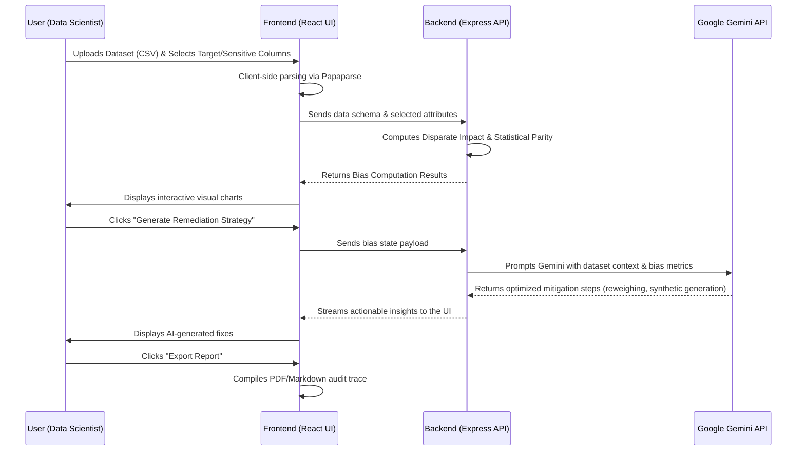

# FairLens: Hackathon Pitch & Technical Analysis

This document provides a complete breakdown of the **FairLens** platform. It is structured to help you quickly pull content for your Hackathon PowerPoint presentation, covering the core problem, our solution, feature sets, technical architecture, and the internal data flow.

---

## 1. The Problem Space
> **Why does this matter?**

Artificial Intelligence models are increasingly being used to make life-altering decisions—from approving mortgages and screening job candidates to diagnosing medical conditions. However, these models learn from historical data, which inherently contains human biases. 

**The core issues we are solving:**
1. **Hidden Disparities:** Data scientists often lack intuitive, visual tools to immediately recognize demographic imbalances in datasets before training a model.
2. **Complex Remediation:** Fixing bias requires deep statistical knowledge (re-weighting, suppression), which is a massive bottleneck.
3. **Black Box Auditing:** Generating compliance-ready fairness reports for stakeholders is usually a complex, manual process.

---

## 2. Our Solution: FairLens
> **What is it?**

**FairLens** is a next-generation, clinical-grade AI fairness auditor. It is a streamlined web platform designed to help developers and compliance officers **Detect, Measure, and Remediate** algorithmic bias within their datasets *before* they ever hit production.

By combining deterministic statistical formulas with the advanced reasoning capabilities of **Google Gemini**, FairLens takes a complex mathematical problem and turns it into a highly actionable, visual, and guided workflow.

---

## 3. Platform Overview & Features
> **What can users do?**

The FairLens dashboard operates on a strict, easy-to-follow pipeline:

- 📊 **Inspect:** Securely upload CSV datasets or load sample scenarios (e.g., HR datasets, Loan data). The platform automatically parses columns and identifies likely sensitive attributes (Gender, Race, Age).
- ⚖️ **Measure:** Calculates complex legal and statistical fairness thresholds in real-time. Highlights metrics like **Disparate Impact** and **Statistical Parity Differences** using animated gauges and visual charts.
- 🔧 **Remediate (Fix):** The core differentiator. Instead of just flagging a problem, FairLens leverages generative AI (Google Gemini) to recommend fix strategies such as feature suppression, data re-weighting, or synthetic over-sampling.
- 📄 **Report:** One-click generation of exportable audit reports detailing the initial bias, the mitigation strategies applied, and the final compliance status.
- 🤖 **AI Copilot & Prompt Scanner:** Built-in generative AI assistant to help developers debug their algorithms, explain complex statistical concepts, and actively scan LLM prompts for non-inclusive language.

---

## 4. Technical Architecture
> **How is it built?**

FairLens is a modern decoupled Full-Stack Web Application relying heavily on Edge/Cloud AI.

### Frontend (Client-Side)
- **Framework:** React 19 + Vite for ultra-fast HMR and optimized production builds.
- **Styling:** Custom "Clinical Futurism" Design System using CSS Variables and Tailwind CSS for a sleek, dark-mode HUD aesthetic.
- **Data Visualization:** `recharts` for rendering complex demographic distribution graphs.
- **Processing:** `papaparse` for secure, rapid client-side parsing of large CSV files without taxing the server.

### Backend (Server-Side)
- **Framework:** Node.js + Express.js REST API.
- **Role:** Acts as the secure middleware and logic engine. It processes the deep statistical logic that is too heavy for the client.
- **AI Integration:** Securely orchestrates API calls to the **Google Gemini Engine**.

---

## 5. Internal Process Flow (How it Operates)
> **The step-by-step lifecycle of data in the app.**

### High-Level Summary of the Flow:
1. **Entry:** User lands on the interactive Landing view and authenticates/enters the app.
2. **Data Ingestion:** The CSV is parsed efficiently in the browser.
3. **Computation Ring:** The frontend syncs the metadata with the Express backend, which executes statistical formulas to search for threshold violations (e.g., the 80% rule in Disparate Impact).
4. **AI Mitigation Request:** When users request a fix, the backend formats a complex context window and sends it to the Gemini API, which acts as a "Senior Data Scientist" determining the safest way to balance the data without destroying its predictive validity. 
5. **Output Generation:** The results are pipelined back down to the UI Recharts components, and finally compiled into a clean, exportable compliance receipt.
