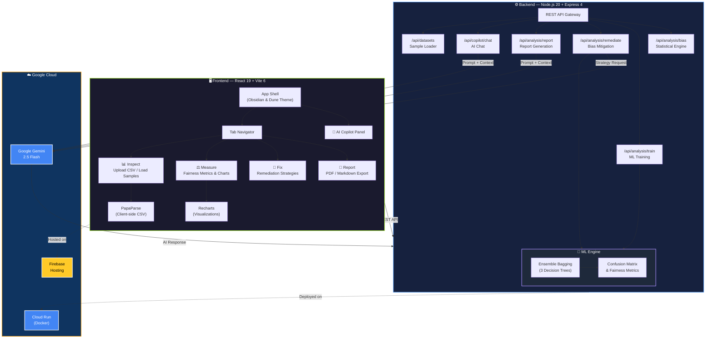
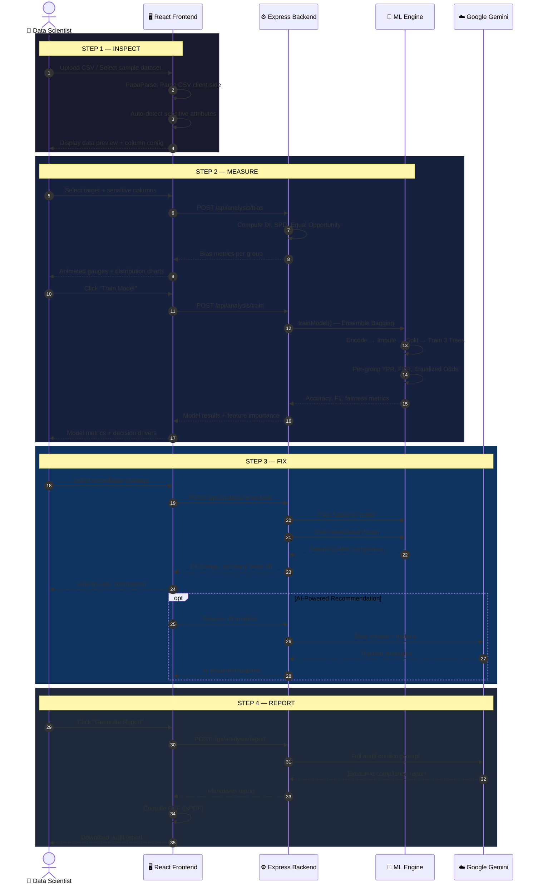
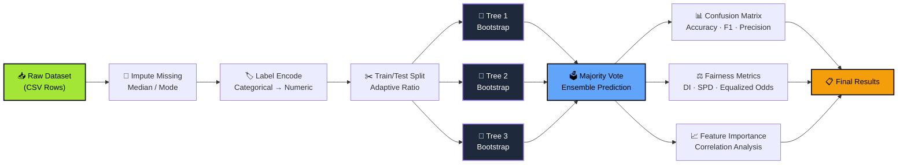
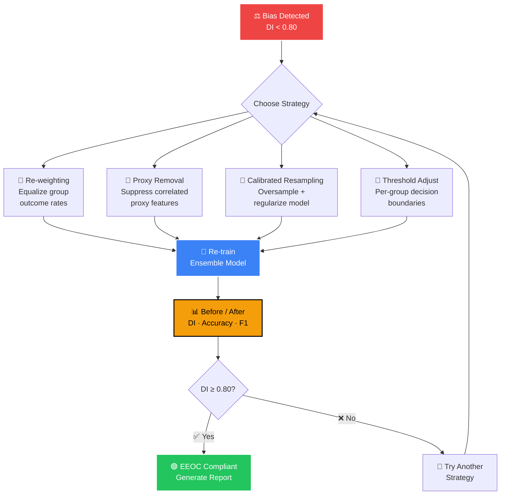
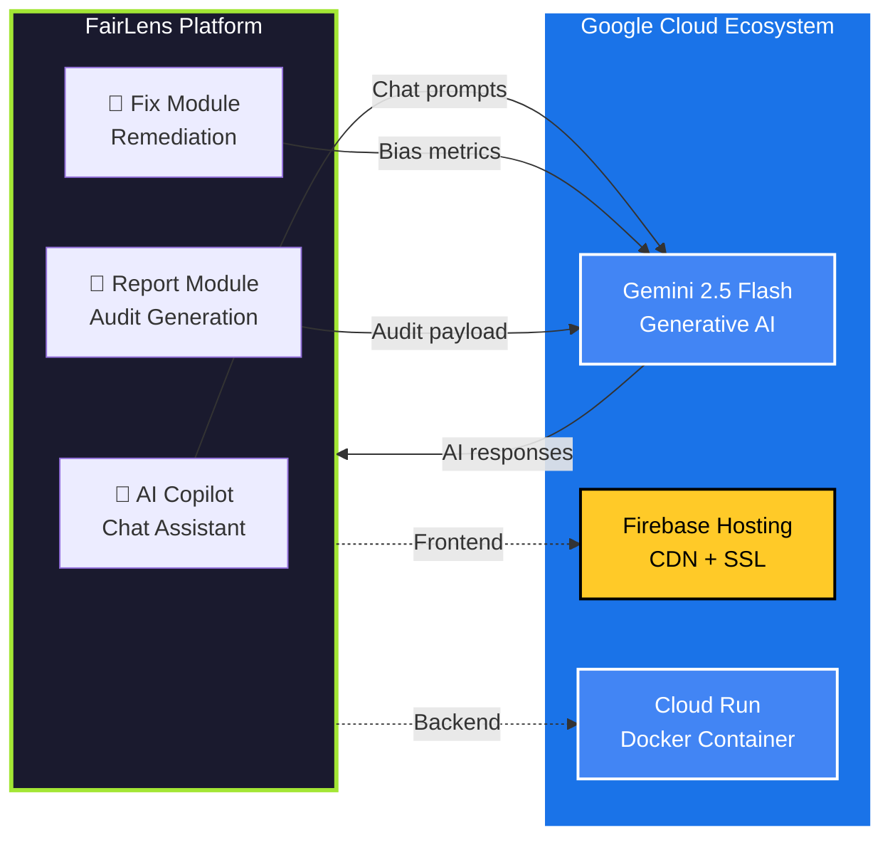

# FairLens — Google Solution Challenge 2026

> **Pitch Deck Content — GSC 2026 Official Template Format**
>
> This follows the mandatory Google Solution Challenge slide structure.
> Copy each slide's content into the official GSC PPT template from your hackathon dashboard.
> Mermaid diagrams at the bottom → paste into [mermaid.live](https://mermaid.live) → export SVG/PNG → insert into slides.

---

## Slide 1 — Cover Slide

| Field | Value |
|-------|-------|
| **Project Name** | FairLens |
| **Tagline** | Clinical-Grade AI Fairness Auditor & Compliance Dossier Generator |
| **Team Name** | [Your Team Name] |
| **Team Members** | [Member 1], [Member 2], [Member 3], [Member 4] |
| **University** | [Your University] |
| **Country** | India |

---

## Slide 2 — Problem Statement

### What problem are you solving?

AI systems make **life-altering decisions** — hiring, lending, medical diagnoses, criminal sentencing — but they learn from **historically biased data**, producing systematically unfair outcomes for marginalized groups.

### Why does it matter?

- **78% of AI hiring tools** show measurable gender or racial bias (UNESCO 2024)
- Regulatory standards like the **EEOC 4/5ths Rule** and the **India DPDP Act 2023** mandate fairness auditing, yet most engineering teams lack the tools to perform complex statistical and model-level bias mitigation.
- Biased AI leads to massive regulatory fines, legal liabilities, and discriminatory systemic outcomes.

### Who is affected?

Job applicants, loan seekers, patients, and defendants — particularly underrepresented demographic groups and intersectional populations who face compounded disadvantages.

---

## Slide 3 — UN Sustainable Development Goals

### Which UN SDGs does your project address?

| UN SDG | Target | How FairLens Addresses It |
|--------|--------|--------------------------|
| 🟠 **SDG 10 — Reduced Inequalities** | Target 10.3: Ensure equal opportunity and reduce inequalities of outcome | FairLens detects and remediates algorithmic discrimination in hiring, lending, healthcare, and justice datasets — ensuring AI treats all demographic groups fairly |
| 🔵 **SDG 16 — Peace, Justice & Strong Institutions** | Target 16.6: Develop effective, accountable, and transparent institutions | FairLens generates auditable compliance reports that hold AI systems accountable, enabling organizations to prove fairness in regulatory submissions |

---

## Slide 4 — Solution Overview

### What is FairLens?

FairLens is a **full-stack web platform** that provides an end-to-end, visual 4-step pipeline to **detect, quantify, mitigate, and document** algorithmic bias in datasets and ML model predictions.

### Key Product Capabilities

| Module | Feature | What It Does |
|------|--------|-------------|
| 📊 **Inspect** | CSV Upload & Column X-Ray | PapaParse reads data client-side (privacy-first). Column X-Ray auto-detects sensitive attributes. |
| ⚖ **Measure** | Multi-Metric & Intersectional Analysis | Computes Disparate Impact and Statistical Parity. Renders an **Intersectional Bias Matrix** (e.g. Gender × Race) with Gemini-powered explanations. Trains an **Ensemble Bagged Decision Tree** to evaluate model predictions. |
| 🔄 **Counterfactual** | Profile Flipper | Simulates "what-if" scenarios at the individual level by flipping attributes (like gender) to verify if model decisions change. |
| 🔧 **Fix** | Auto-Mitigation Simulator | Applies and compares Re-weighting, Proxy Removal, and Calibrated Resampling. Gemini ranks and recommends optimal mitigation strategies. |
| 📄 **Report** | Compliance Auditor | Evaluates results against the **EEOC 4/5ths Rule** and **India DPDP Act 2023**, generating an official PDF/Markdown audit dossier. |
| 🌐 **Localization** | Bilingual Core | Full localization support in both **English and Hindi** for regional auditing. |

---

## Slide 5 — Google Technology Usage

### Which Google technologies does your solution use?

| Google Technology | How FairLens Uses It | Why This Technology |
|------------------|---------------------|---------------------|
| **Google Gemini 2.5 Flash** | Powers 3 core features: (1) AI Copilot chat, (2) Intersectional bias pattern explanations, (3) Compliance report generation & remediation recommendations | Best-in-class reasoning for complex statistical analysis and professional report writing |
| **Firebase Hosting** | Hosts the React frontend with global CDN edge caching and automatic SSL | Zero-config deployment with instant global availability |
| **Google Cloud Run** | Containerized backend deployment via Docker | Auto-scaling, pay-per-use serverless compute for the ML engine |

### Gemini Integration Details

**1. Intersectional Bias Explainer**
```
Input:  Compounded disparity rates (best vs worst intersecting group rates)
Output: 2-sentence compliance context explaining the structural and regulatory implications
```

**2. Remediation Advisor & Report Writer**
```
Input:  Full analysis payload (data composition, bias findings, ML model results, remediation outcomes)
Output: Executive-style compliance dossier (6 sections: Summary, Data Analysis, Bias Findings, ML Pipeline, EEOC/DPDP Assessment, Recommendations)
```

**3. AI Copilot**
```
Input:  Natural language questions about fairness, bias debugging, prompt scanning
Output: Conversational explanations with actionable guidance
```

---

## Slide 6 — Technical Architecture

### System Architecture Diagram

> *Insert the "System Architecture" Mermaid diagram (Diagram 1 below) as SVG/PNG*

### Tech Stack

| Layer | Technology |
|-------|-----------|
| **Frontend** | React 19 + Vite 6 |
| **Styling** | CSS Variables + Tailwind CSS 4 ("Obsidian & Dune" design system) |
| **Charts** | Recharts (animated gauges, demographic distributions, trade-off charts) |
| **CSV Parsing** | PapaParse (client-side, privacy-preserving) |
| **Backend** | Node.js 20 + Express 4 (REST API) |
| **ML Engine** | ml-cart (Ensemble Bagging — 3 Decision Trees), ml-confusion-matrix |
| **AI** | Google Gemini 2.5 Flash via `@google/generative-ai` |
| **Export** | jsPDF + html2canvas (PDF audit reports) |
| **Deployment** | Docker → Cloud Run (backend), Firebase Hosting (frontend) |

---

## Slide 7 — Implementation & Demo

### Current Status: ✅ Fully Functional MVP

| Feature | Status |
|---------|--------|
| CSV upload + sample dataset loading (7 datasets, up to 15K rows) | ✅ Complete |
| Statistical bias analysis (DI, SPD, Equal Opportunity) | ✅ Complete |
| Intersectional bias matrix + Gemini-powered explanations | ✅ Complete |
| Profile Flipper (Counterfactual individual simulation) | ✅ Complete |
| ML model training (Ensemble Bagging, adaptive hyperparameters) | ✅ Complete |
| 4 remediation strategies with before/after comparison | ✅ Complete |
| AI-powered audit report generation via Gemini (EEOC & DPDP checkers) | ✅ Complete |
| Bilingual interface toggle (English / Hindi) | ✅ Complete |
| Automated Narrated Interactive Demo Mode | ✅ Complete |
| PDF/Markdown report export | ✅ Complete |
| Production deployment (Cloud Run + Firebase) | ✅ Complete |

### Demo Script (90-second / 3-minute walk-through)

| Time | Action | Product Verification |
|------|--------|----------------------|
| 0:00–0:15 | Click **"Watch 90-sec Demo"** | The automated narrator triggers, highlighting steps and loading "Hiring Bias 15K" |
| 0:15–0:35 | Auto-configure columns & view distributions | Auto-detects sensitive attributes (`gender`, `race`) and sets target variable (`hired`) |
| 0:35–0:55 | Navigate to Measure & run audit | Gauge animates showing bias level; Intersectional Matrix loads, and Gemini explains the pattern |
| 0:55–1:10 | Train ML model & flip profiles | Server trains ensemble bagging model; Profile Flipper flips attributes to test counterfactual fairness |
| 1:10–1:25 | Navigate to Fix & apply Re-weighting | Renders side-by-side comparison illustrating a rise in Disparate Impact with minimal accuracy trade-off |
| 1:25–1:30 | Report tab & export PDF | Gemini compiles compliance document; official dossier exported as PDF |

---

## Slide 8 — Unique Value & Competitive Advantage

### How is FairLens different from existing tools?

| Feature | FairLens | IBM AI Fairness 360 | Google What-If Tool | Microsoft Fairlearn |
|---------|----------|---------------------|--------------------|--------------------|
| No-code visual interface | ✅ | ❌ (Python library) | ⚠️ (Limited) | ❌ (Python library) |
| Intersectional Bias Matrix | ✅ | ❌ | ❌ | ❌ |
| Profile Flipper (Counterfactual) | ✅ | ❌ | ⚠️ (Complex) | ❌ |
| AI-powered recommendations (Gemini) | ✅ | ❌ | ❌ | ❌ |
| Automated compliance dossiers | ✅ | ❌ | ❌ | ❌ |
| Bilingual Locale Support | ✅ | ❌ | ❌ | ❌ |
| Narrated Interactive Demo Mode | ✅ | ❌ | ❌ | ❌ |
| Zero setup (web-based) | ✅ | ❌ | ⚠️ | ❌ |

---

## Slide 9 — Scalability & Future Impact

### Who uses FairLens?

- **Data Scientists**: Audit and debug model fairness before production deployment.
- **Compliance & Legal Officers**: Verify algorithms against EEOC guidelines and the India DPDP Act 2023.
- **HR & Financial Services**: Audit recruitment and credit scoring models for systemic bias.

### Scalability

- **Stateless REST API**: Horizontally auto-scales on Cloud Run.
- **Privacy-First**: Client-side parsing ensures sensitive raw data never touches the backend database.
- **Horizontally Expandable**: Support for custom models (XGBoost, Random Forest) via clean, modular backend API endpoints.

---

## Slide 10 — Team & Links

| Resource | Link |
|----------|------|
| 🔗 **GitHub** | [github.com/DevWithOm/FairLens](https://github.com/DevWithOm/FairLens) |
| 🌐 **Live Demo** | [Your deployed URL] |
| 🎥 **Demo Video** | [Your YouTube link] |

---

## 🧩 Mermaid.js Diagrams — Copy-Paste Ready

### Diagram 1: System Architecture (for Slide 6)


```mermaid
graph TB
    subgraph CLIENT["🖥️ Frontend — React 19 + Vite 6"]
        direction TB
        UI["App Shell<br/>(Obsidian & Dune Theme)"]
        TABS["Tab Navigator"]
        UI --> TABS
        TABS --> INSPECT["📊 Inspect<br/>Upload CSV / Load Samples"]
        TABS --> MEASURE["⚖️ Measure<br/>Fairness Metrics & Charts"]
        TABS --> FIX["🔧 Fix<br/>Remediation Strategies"]
        TABS --> REPORT["📄 Report<br/>PDF / Markdown Export"]
        COPILOT["🤖 AI Copilot Panel"]
        UI --> COPILOT
        PP["PapaParse<br/>(Client-side CSV)"]
        RC["Recharts<br/>(Visualizations)"]
        INSPECT --> PP
        MEASURE --> RC
    end

    subgraph SERVER["⚙️ Backend — Node.js 20 + Express 4"]
        direction TB
        API["REST API Gateway"]
        API --> BIAS["/api/analysis/bias<br/>Statistical Engine"]
        API --> TRAIN["/api/analysis/train<br/>ML Training"]
        API --> REMED["/api/analysis/remediate<br/>Bias Mitigation"]
        API --> REPT["/api/analysis/report<br/>Report Generation"]
        API --> CHAT["/api/copilot/chat<br/>AI Chat"]
        API --> DATA["/api/datasets<br/>Sample Loader"]

        subgraph ML["🧠 ML Engine"]
            DT["Ensemble Bagging<br/>(3 Decision Trees)"]
            CM["Confusion Matrix<br/>& Fairness Metrics"]
            DT --> CM
        end
        TRAIN --> ML
        REMED --> ML
    end

    subgraph GOOGLE["☁️ Google Cloud"]
        GEMINI["Google Gemini<br/>2.5 Flash"]
        FIREBASE["Firebase<br/>Hosting"]
        CLOUDRUN["Cloud Run<br/>(Docker)"]
    end

    CLIENT -->|"REST API"| SERVER
    REPT -->|"Prompt + Context"| GEMINI
    CHAT -->|"Prompt + Context"| GEMINI
    REMED -->|"Strategy Request"| GEMINI
    GEMINI -->|"AI Response"| SERVER
    CLIENT -.->|"Hosted on"| FIREBASE
    SERVER -.->|"Deployed on"| CLOUDRUN

    style CLIENT fill:#1a1a2e,stroke:#a3e635,stroke-width:2px,color:#fff
    style SERVER fill:#16213e,stroke:#60a5fa,stroke-width:2px,color:#fff
    style GOOGLE fill:#0f3460,stroke:#f59e0b,stroke-width:2px,color:#fff
    style ML fill:#1e293b,stroke:#a78bfa,stroke-width:2px,color:#fff
    style GEMINI fill:#4285F4,stroke:#fff,stroke-width:2px,color:#fff
    style FIREBASE fill:#FFCA28,stroke:#fff,stroke-width:2px,color:#000
    style CLOUDRUN fill:#4285F4,stroke:#fff,stroke-width:2px,color:#fff
```

### Diagram 2: Process Flow — Sequence Diagram (for Slide 6/7)


```mermaid
sequenceDiagram
    autonumber
    actor User as 👤 Data Scientist
    participant Client as 🖥️ React Frontend
    participant Server as ⚙️ Express Backend
    participant ML as 🧠 ML Engine
    participant Gemini as ☁️ Google Gemini

    rect rgb(26, 26, 46)
        Note over User,Client: STEP 1 — INSPECT
        User->>Client: Upload CSV / Select sample dataset
        Client->>Client: PapaParse: Parse CSV client-side
        Client->>Client: Auto-detect sensitive attributes
        Client-->>User: Display data preview + column config
    end

    rect rgb(22, 33, 62)
        Note over User,ML: STEP 2 — MEASURE
        User->>Client: Select target + sensitive columns
        Client->>Server: POST /api/analysis/bias
        Server->>Server: Compute DI, SPD, Equal Opportunity
        Server-->>Client: Bias metrics per group
        Client-->>User: Animated gauges + distribution charts

        User->>Client: Click "Train Model"
        Client->>Server: POST /api/analysis/train
        Server->>ML: trainModel() — Ensemble Bagging
        ML->>ML: Encode → Impute → Split → Train 3 Trees
        ML->>ML: Per-group TPR, FPR, Equalized Odds
        ML-->>Server: Accuracy, F1, fairness metrics
        Server-->>Client: Model results + feature importance
        Client-->>User: Model metrics + decision drivers
    end

    rect rgb(15, 52, 96)
        Note over User,Gemini: STEP 3 — FIX
        User->>Client: Select remediation strategy
        Client->>Server: POST /api/analysis/remediate
        Server->>ML: Train baseline model
        Server->>ML: Train remediated model
        ML-->>Server: Before vs After comparison
        Server-->>Client: DI change, accuracy trade-off
        Client-->>User: Side-by-side comparison

        opt AI-Powered Recommendation
            Client->>Server: Request AI analysis
            Server->>Gemini: Bias context + metrics
            Gemini-->>Server: Ranked strategies
            Server-->>Client: AI recommendations
        end
    end

    rect rgb(30, 41, 59)
        Note over User,Gemini: STEP 4 — REPORT
        User->>Client: Click "Generate Report"
        Client->>Server: POST /api/analysis/report
        Server->>Gemini: Full audit context prompt
        Gemini-->>Server: Executive compliance report
        Server-->>Client: Markdown report
        Client->>Client: Compile PDF (jsPDF)
        Client-->>User: Download audit report
    end
```

### Diagram 3: ML Engine Pipeline (for Slide 6)


```mermaid
flowchart LR
    A["📥 Raw Dataset<br/>(CSV Rows)"] --> B["🧹 Impute Missing<br/>Median / Mode"]
    B --> C["🏷️ Label Encode<br/>Categorical → Numeric"]
    C --> D["✂️ Train/Test Split<br/>Adaptive Ratio"]

    D --> E["🌲 Tree 1<br/>Bootstrap"]
    D --> F["🌲 Tree 2<br/>Bootstrap"]
    D --> G["🌲 Tree 3<br/>Bootstrap"]

    E --> H["🗳️ Majority Vote<br/>Ensemble Prediction"]
    F --> H
    G --> H

    H --> I["📊 Confusion Matrix<br/>Accuracy · F1 · Precision"]
    H --> J["⚖️ Fairness Metrics<br/>DI · SPD · Equalized Odds"]
    H --> K["📈 Feature Importance<br/>Correlation Analysis"]

    I --> L["📋 Final Results"]
    J --> L
    K --> L

    style A fill:#a3e635,stroke:#000,color:#000,stroke-width:2px
    style H fill:#60a5fa,stroke:#000,color:#000,stroke-width:2px
    style L fill:#f59e0b,stroke:#000,color:#000,stroke-width:2px
    style E fill:#1e293b,stroke:#a78bfa,color:#fff,stroke-width:2px
    style F fill:#1e293b,stroke:#a78bfa,color:#fff,stroke-width:2px
    style G fill:#1e293b,stroke:#a78bfa,color:#fff,stroke-width:2px
```

### Diagram 4: Remediation Flow (for Slide 4/7)


```mermaid
graph TD
    START["⚖️ Bias Detected<br/>DI < 0.80"] --> CHOOSE{"Choose Strategy"}

    CHOOSE --> RW["🔄 Re-weighting<br/>Equalize group<br/>outcome rates"]
    CHOOSE --> PR["🚫 Proxy Removal<br/>Suppress correlated<br/>proxy features"]
    CHOOSE --> CR["🎯 Calibrated Resampling<br/>Oversample +<br/>regularize model"]
    CHOOSE --> TA["📐 Threshold Adjust<br/>Per-group decision<br/>boundaries"]

    RW --> RETRAIN["🧠 Re-train<br/>Ensemble Model"]
    PR --> RETRAIN
    CR --> RETRAIN
    TA --> RETRAIN

    RETRAIN --> COMPARE["📊 Before / After<br/>DI · Accuracy · F1"]

    COMPARE --> PASS{"DI ≥ 0.80?"}
    PASS -->|"✅ Yes"| COMPLIANT["🟢 EEOC Compliant<br/>Generate Report"]
    PASS -->|"❌ No"| ITERATE["🔁 Try Another<br/>Strategy"]
    ITERATE --> CHOOSE

    style START fill:#ef4444,stroke:#fff,color:#fff,stroke-width:2px
    style COMPLIANT fill:#22c55e,stroke:#fff,color:#fff,stroke-width:2px
    style RETRAIN fill:#3b82f6,stroke:#fff,color:#fff,stroke-width:2px
    style COMPARE fill:#f59e0b,stroke:#000,color:#000,stroke-width:2px
```

### Diagram 5: Google Technology Map (for Slide 5)


```mermaid
graph LR
    subgraph FL["FairLens Platform"]
        direction TB
        COP["🤖 AI Copilot<br/>Chat Assistant"]
        FIX["🔧 Fix Module<br/>Remediation"]
        RPT["📄 Report Module<br/>Audit Generation"]
    end

    subgraph GC["Google Cloud Ecosystem"]
        direction TB
        GEM["Gemini 2.5 Flash<br/>Generative AI"]
        FB["Firebase Hosting<br/>CDN + SSL"]
        CR["Cloud Run<br/>Docker Container"]
    end

    COP -->|"Chat prompts"| GEM
    FIX -->|"Bias metrics"| GEM
    RPT -->|"Audit payload"| GEM
    GEM -->|"AI responses"| FL

    FL -.->|"Frontend"| FB
    FL -.->|"Backend"| CR

    style FL fill:#1a1a2e,stroke:#a3e635,stroke-width:3px,color:#fff
    style GC fill:#1a73e8,stroke:#fff,stroke-width:3px,color:#fff
    style GEM fill:#4285F4,stroke:#fff,stroke-width:2px,color:#fff
    style FB fill:#FFCA28,stroke:#000,stroke-width:2px,color:#000
    style CR fill:#4285F4,stroke:#fff,stroke-width:2px,color:#fff
```
